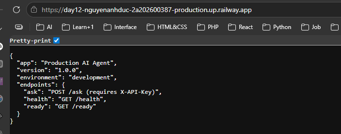

#  Delivery Checklist — Day 12 Lab Submission

> **Student Name:** Nguyễn Anh Đức
> **Student ID:** 2A202600387  
> **Date:** 17/4/2026

---

##  Submission Requirements

Submit a **GitHub repository**: https://github.com/dancru299/Day12-NguyenAnhDuc-2A202600387

### 1. Mission Answers (40 points)

Create a file `MISSION_ANSWERS.md` with your answers to all exercises:

```markdown
# Day 12 Lab - Mission Answers

## Part 1: Localhost vs Production

### Exercise 1.1: Anti-patterns found
1. [Your answer]
2. [Your answer]
...

### Exercise 1.3: Comparison table
| Feature | Develop | Production | Why Important? |
|---------|---------|------------|----------------|
| Config  | ...     | ...        | ...            |
...

## Part 2: Docker

### Exercise 2.1: Dockerfile questions
1. Base image: [Your answer]
2. Working directory: [Your answer]
...

### Exercise 2.3: Image size comparison
- Develop: [X] MB
- Production: [Y] MB
- Difference: [Z]%

## Part 3: Cloud Deployment

### Exercise 3.1: Railway deployment
- URL: https://day12-nguyenanhduc-2a202600387-production.up.railway.app
- Screenshot: 

## Part 4: API Security

### Exercise 4.1-4.3: Test results
[Paste your test outputs]

### Exercise 4.4: Cost guard implementation
[Explain your approach]

## Part 5: Scaling & Reliability

### Exercise 5.1-5.5: Implementation notes
[Your explanations and test results]
```

---

### 2. Full Source Code - Lab 06 Complete (60 points)

Your final production-ready agent with all files:

```
your-repo/
├── app/
│   ├── main.py              # Main application
│   ├── config.py            # Configuration
│   ├── auth.py              # Authentication
│   ├── rate_limiter.py      # Rate limiting
│   └── cost_guard.py        # Cost protection
├── utils/
│   └── mock_llm.py          # Mock LLM (provided)
├── Dockerfile               # Multi-stage build
├── docker-compose.yml       # Full stack
├── requirements.txt         # Dependencies
├── .env.example             # Environment template
├── .dockerignore            # Docker ignore
├── railway.toml             # Railway config (or render.yaml)
└── README.md                # Setup instructions
```

**Requirements:**
-  All code runs without errors
-  Multi-stage Dockerfile (image < 500 MB)
-  API key authentication
-  Rate limiting (10 req/min)
-  Cost guard ($10/month)
-  Health + readiness checks
-  Graceful shutdown
-  Stateless design (Redis)
-  No hardcoded secrets

---

### 3. Service Domain Link

Create a file `DEPLOYMENT.md` with your deployed service information:

```markdown
# Deployment Information

## Public URL
https://day12-nguyenanhduc-2a202600387-production.up.railway.app

## Platform
Railway

## Test Commands

### Health Check
```bash
curl https://day12-nguyenanhduc-2a202600387-production.up.railway.app/health
{"status":"ok","version":"1.0.0","environment":"development","checks":{"llm":"openai"}}
```

### API Test (with authentication)
```bash
curl -X POST https://day12-nguyenanhduc-2a202600387-production.up.railway.app/ask \
  -H "X-API-Key: 1234567890" \
  -H "Content-Type: application/json" \
  -d '{"question": "Tìm khách sạn ở Đà Nẵng dưới 1 triệu một đêm"}'
```

## Environment Variables Set
- PORT
- REDIS_URL
- AGENT_API_KEY
- LOG_LEVEL

## Screenshots
- [Deployment dashboard](screenshots/dashboard.png)
- [Service running](screenshots/running.png)
- [Test results](screenshots/test.png)
```

##  Pre-Submission Checklist

- [ ] Repository is public (or instructor has access)
- [ ] `MISSION_ANSWERS.md` completed with all exercises
- [ ] `DEPLOYMENT.md` has working public URL
- [ ] All source code in `app/` directory
- [ ] `README.md` has clear setup instructions
- [ ] No `.env` file committed (only `.env.example`)
- [ ] No hardcoded secrets in code
- [ ] Public URL is accessible and working
- [ ] Screenshots included in `screenshots/` folder
- [ ] Repository has clear commit history

---

##  Self-Test

Before submitting, verify your deployment:

```bash
BASE=https://day12-nguyenanhduc-2a202600387-production.up.railway.app
KEY=1234567890

# 1. Health check
curl $BASE/health
# → {"status":"ok","version":"1.0.0","checks":{"llm":"openai"}}

# 2. Authentication required
curl $BASE/ask
# → 401 Unauthorized

# 3. With API key works
curl -H "X-API-Key: $KEY" $BASE/ask \
  -X POST -H "Content-Type: application/json" \
  -d '{"question":"Tìm khách sạn ở Đà Nẵng dưới 1 triệu"}'
# → 200 với câu trả lời TravelBuddy

# 4. Rate limiting
for i in {1..15}; do 
  curl -s -H "X-API-Key: $KEY" $BASE/ask \
    -X POST -H "Content-Type: application/json" \
    -d '{"question":"test"}' | python -c "import sys,json; d=json.load(sys.stdin); print(d.get('detail','ok'))"
done
# → Sau ~10 requests sẽ trả về 429 Too Many Requests
```

---

##  Submission

**Submit your GitHub repository URL:**

```
https://github.com/dancru299/Day12-NguyenAnhDuc-2A202600387
```

**Deadline:** 17/4/2026

---

##  Quick Tips

1.  Test your public URL from a different device
2.  Make sure repository is public or instructor has access
3.  Include screenshots of working deployment
4.  Write clear commit messages
5.  Test all commands in DEPLOYMENT.md work
6.  No secrets in code or commit history

---

##  Need Help?

- Check [TROUBLESHOOTING.md](TROUBLESHOOTING.md)
- Review [CODE_LAB.md](CODE_LAB.md)
- Ask in office hours
- Post in discussion forum

---

**Good luck! **
